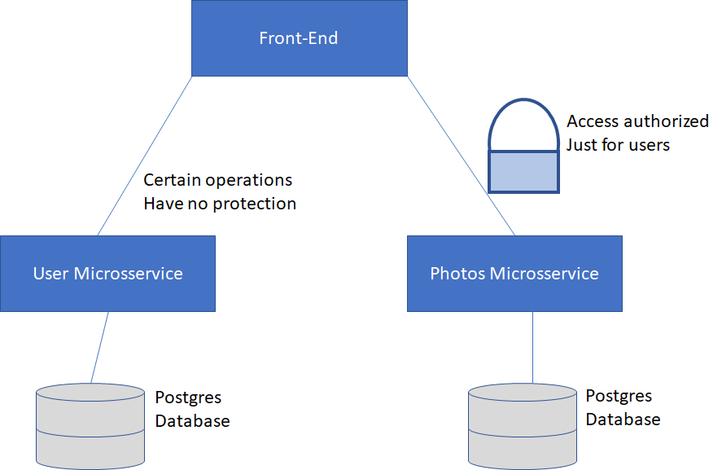

# Microsservices

This project gonna be splitted into two microsservices, which the functionalities it provides compose the overall application functionality.

## User Microsservice

This microsservice gonna have the following responsibilities:

- Handle user management
- Handle user authentication

## Photos Microsservice

This microsservice gonna have the following responsibilities:

- Handle album management
- Handle photo management
- Handle photo storage

## Overall Services Schema

The frontend will manage the callings to microsservices according the data needed.
